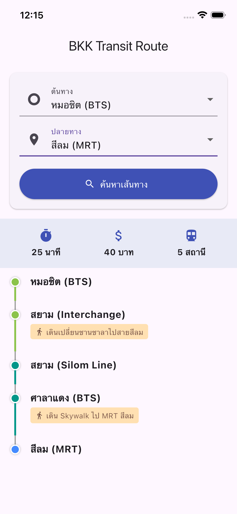

# 🚆 Bangkok Transit Route Finder

A Flutter-based mobile application developed as part of the **Senior Mobile Application Developer Assessment**. This app calculates the optimal route between Bangkok's mass transit stations (BTS/MRT), accounting for travel time, station interchanges, and estimated fares.


## 📱 Application Overview

The problem statement required an application to find routes from Station A to Station B within Bangkok. This solution implements a **Weighted Graph** data structure and uses **Dijkstra’s Algorithm** to determine the most efficient path, treating "Interchanges" (walking between lines) as weighted edges to simulate real-world travel friction.

### Key Features
* **Smart Routing:** Calculates the shortest path based on duration (minutes).
* **Interchange Handling:** Adds specific time penalties for changing lines (e.g., walking from BTS Asok to MRT Sukhumvit).
* **Cost Estimation:** Provides a mock fare calculation based on station count.
* **Visual Timeline:** Displays the route in an intuitive vertical stepper UI, clearly distinguishing between riding and walking/transferring.
* **Scalable Architecture:** Built using separation of concerns principles.

---

## 📸 Screenshots

| Route Selection | Route Result (Timeline) |
|:---:|:---:|
| <br> *Origin & Destination Input* | <br> *Calculated Route & Transfers* |



---

## 🏗 Architecture & Design

The project follows a **Modular / Layered Architecture** to ensure maintainability and testability, suitable for a production-grade environment.

### 1. Domain Layer (`models/`)
Contains pure entity classes describing the core business objects.
* `Station`: Represents a physical node.
* `Edge`: Represents the connection between nodes (includes weight/duration).

### 2. Data Layer (`repositories/`)
Handles data retrieval. currently implemented as a **Mock Repository**, but designed to be easily swapped with a Real API Service.
* `TransitRepository`: Manages the Adjacency List (Graph) of the transit network.

### 3. Service Layer (`services/`)
Contains the core business logic and algorithms, separated from the UI.
* **Algorithm:** `Dijkstra’s Algorithm` using a Priority Queue.
* **Logic:** The graph treats stations as Nodes. A "Transfer" is modeled as a weighted edge between two nodes (e.g., `BTS_SIAM` <-> `BTS_SILOM_LINE` cost = 2 mins).

### 4. Presentation Layer (`screens/`, `widgets/`)
* **UI Pattern:** Uses standard Flutter `setState` for this MVP (to minimize boilerplate for the test), but structured to easily migrate to **BLoC** or **Cubit**.
* **Widgets:** Decomposed into reusable components like `RouteTimeline` and `InfoBadge`.

---

## 📂 Project Structure

```text
lib/
├── models/                  # Data Entities (Station, Edge)
├── repositories/            # Graph Data Source (Mock)
├── services/                # Pathfinding Algorithm (Dijkstra)
├── widgets/                 # Reusable UI Components
├── screens/                 # Application Screens
└── main.dart                # Application Entry Point
